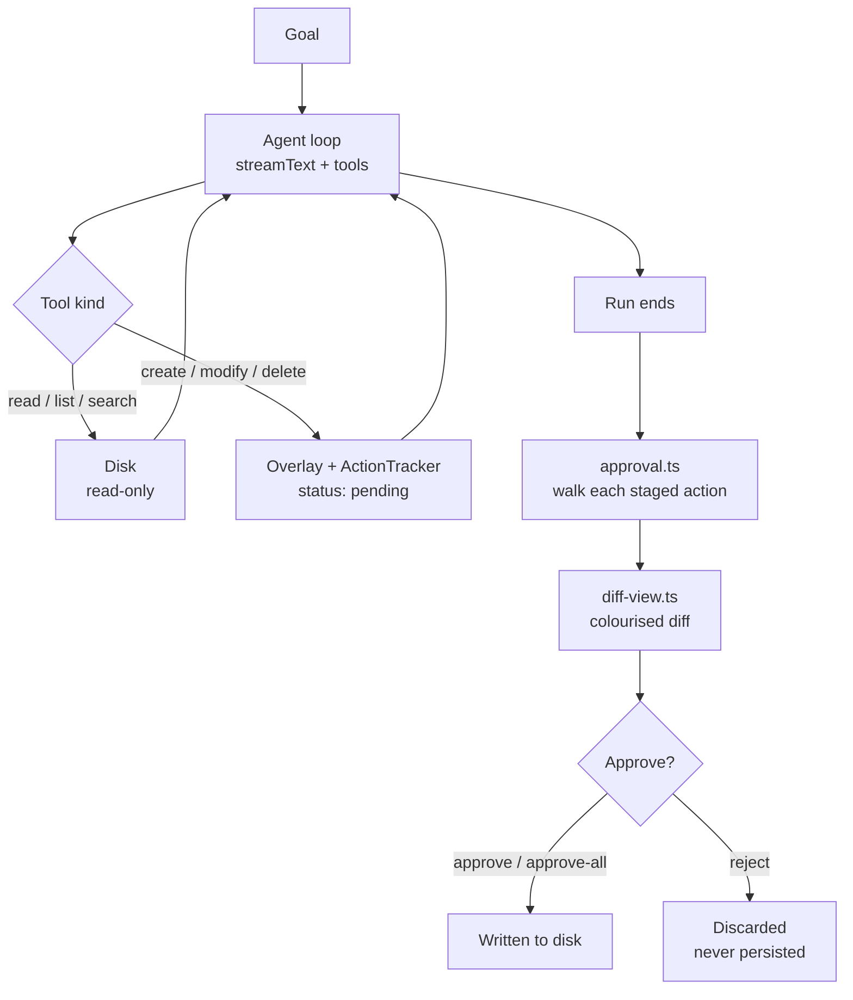

## The scary part isn't the wrong edit

It's that by the time you see the wrong edit, it already happened. An agent with a `write_file` tool is a process with commit rights to your working tree, and its error mode is silent: the file changed, the tests still pass, and you find out three commits later.

The usual mitigations are all after the fact. Work on a branch. Keep the diff small. Read the summary it printed. All of that assumes the write already went through.

AZ-CLAW takes the other approach: the agent has all the write tools, and **none of them touch disk**.

## The staging overlay

Two data structures do the whole job in `modes/agent/tool-executor.ts`:

```ts
private overlay = new Map<string, string>();
private deleted = new Set<string>();
```

Every write tool records intent instead of performing it:

```ts
modifyFile(rel: string, content: string): string {
  // ... validation ...
  this.overlay.set(key, content);
  this.tracker.log({
    type: "file_modify",
    path: key,
    details: { before, after: content },
    status: "pending",
  });
  return `Staged update: ${key}`;
}
```

`createFile` is the same shape. `deleteFile` drops the key from the overlay and adds it to `deleted`. Nothing is written; the tool result the model reads back is the literal string `Staged update: …`, so the agent knows the change is pending rather than believing it landed.

The part that makes this actually work — rather than just making the agent blind — is the read path:

```ts
getEffectiveText(rel: string): string | undefined {
  const key = this.norm(rel);
  if (this.deleted.has(key)) return undefined;
  if (this.overlay.has(key)) return this.overlay.get(key);
  const abs = this.resolveSafe(rel);
  if (!fs.existsSync(abs) || !fs.statSync(abs).isFile()) return undefined;
  return fs.readFileSync(abs, "utf8");
}
```

Deleted, then overlay, then disk. So the agent can create `lib/parser.ts`, read it back two tool calls later, modify it, and delete a file it never really had — all against a filesystem that hasn't changed. It's a copy-on-write view scoped to one run, and it's about fifteen lines.

## Approval is the only path to disk



When the run finishes, `approval.ts` walks the pending actions, `diff-view.ts` renders each as a unified diff (the `diff` package), and you answer approve, reject, or approve-all. Rejected actions are dropped — not stashed, not applied later.

The same flow exists on your phone. `modes/telegram/approval-session.ts` mirrors it with Telegram inline buttons, keeping a per-chat session while the agent runs.

## Four modes, one safety layer

| Mode | What it does |
|---|---|
| **Agent** | Works the codebase with tools; every mutation staged |
| **Plan** | Read-only research (plus Firecrawl web search/scrape), then a step-by-step plan you pick from via checkbox menu or inline buttons |
| **Ask** | Read-only Q&A over the codebase; can save the answer as markdown — routed through the same approval flow |
| **Second Brain** | Dump text, URLs or images; ask questions later |

The Ask detail is the one I'd point at. "Save this answer to a file" is a write, so it does not get a shortcut around the approval step just because it's a nicer kind of write.

From Telegram, the same four:

| Command | What it does |
|---|---|
| `/ask <question>` | Read-only Q&A over the codebase |
| `/plan <goal>` | Plan; pick steps with inline buttons |
| `/agent <goal>` | Runs the agent; approve/reject with inline buttons |
| `/dump <anything>` | Saves text or a URL to the Second Brain |
| `/brain <question>` | Answers from the brain, with citations |
| Photo message | Vision extraction, then stored |

## Fallback that lives in the model, not the call site

Groq is the primary LLM — fast, generous free tier — and its free tier does what free tiers do. Rather than wrapping every call in a retry, `ai/ai.config.ts` wraps the *model object* once:

```ts
function withFallback(primary: ModelObject, fallback: () => ModelObject): ModelObject {
  const rescue = (op: "doGenerate" | "doStream") => async (options: any) => {
    try {
      return await (primary[op] as any)(options);
    } catch (err) {
      console.warn(
        `[ai] ${primary.provider}/${primary.modelId} failed (${err instanceof Error ? err.message : err}); falling back to OpenRouter`,
      );
      return (fallback()[op] as any)(options);
    }
  };

  return new Proxy(primary, {
    get(target, prop, receiver) {
      if (prop === "doGenerate" || prop === "doStream") return rescue(prop);
      return Reflect.get(target, prop, receiver);
    },
  });
}
```

A `Proxy` intercepting exactly two properties. `Reflect.get` passes everything else — `provider`, `modelId`, `specificationVersion`, whatever the AI SDK asks for next — straight through, so this doesn't have to track the provider interface as it changes.

Every mode calls `getAgentModel()` and gets the fallback for free: agent loop, planner, Q&A, brain enrichment. Rate limit mid-stream, the warning prints, the identical call re-issues on OpenRouter, and the run continues. No mode contains the word "retry".

Default Groq model is `openai/gpt-oss-120b`, and the constraint on swapping it is specific: tool-calling **and** `json_schema` support, because Plan mode needs structured output and Agent mode needs tools.

## Second Brain

Dump anything and ask about it later:

```
dump ──► enrich ──► embed ──► store ──► match_notes ──► answer
        LLM title/   Gemini    InsForge   cosine search   citations,
        tags/summary 1536-dim  notes table (HNSW index)   no invented facts
```

- `enrich.ts` generates a title, tags and summary; URLs get fetched and their page content captured (Firecrawl when the key is set)
- `vision.ts` runs images through Groq's Llama-4 Scout, so a photo sent to the bot becomes searchable text
- `embeddings.ts` uses Gemini's free 1536-dim embeddings, with OpenRouter as fallback
- `store.ts` writes to InsForge (Postgres + pgvector, HNSW index) and queries a `match_notes()` cosine-similarity RPC

Answers cite the stored notes they came from. That's the guardrail — a note store that invents facts is worse than no note store, because you'd trust it.


## The Telegram lock

`modes/telegram/auth.ts` checks every update against `TELEGRAM_OWNER_ID` and ignores everyone else. That is the entire authorization model, and it should be, because this bot runs an agent against a checkout on your machine. Anything softer than "one chat ID, hardcoded from env" is a remote code execution feature with a chat interface.

## Setup

```bash
bun install
cp .env.example .env
bun index.ts wakeup
```

`wakeup` prints a figlet banner and asks CLI or Telegram. One manual step beyond the keys: apply `modes/brain/schema.sql` to your InsForge database once — it creates the `notes` table, the `match_notes()` function and the HNSW index. Then `bun modes/brain/smoke.ts` for a round-trip check.

Keys: `GROQ_API_KEY` and `OPENROUTER_API_KEY` (+ `OPENROUTER_DEFAULT_MODEL`) are required; `GEMINI_API_KEY` and the InsForge pair are needed for the brain; the Telegram pair for the bot; `FIRECRAWL_API_KEY` is optional and unlocks web search in Plan and Ask.

No build step — Bun runs the TypeScript directly.

## It's checked in

The `examples/` folder has real, unedited output: an [Ask run](https://github.com/Prateek1771/az-claw/tree/main/examples) explaining `/modes/agent` from the codebase, a Plan run designing data storage for a todo app, and a todo app the agent built end to end. Asked what was inside its own agent directory, it answered:

> The `/modes/agent` directory contains core components of an AI agent management system that handles workflow, approvals, and codebase operations.

Which is a fair description of a program whose main feature is not trusting itself.

**[Source](https://github.com/Prateek1771/az-claw)**
