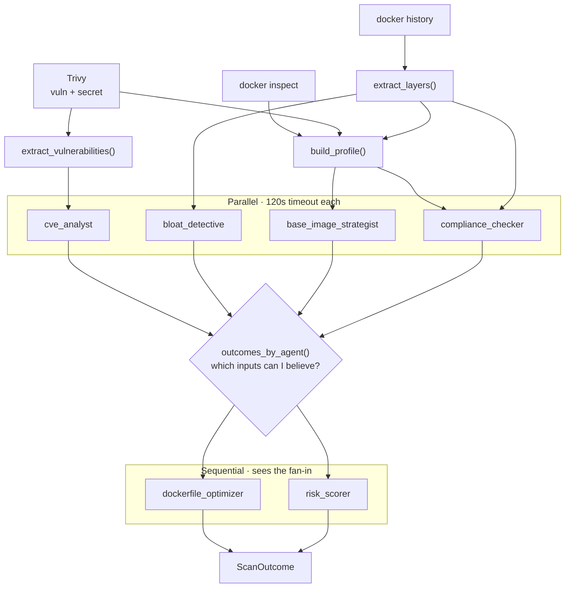

## The failure mode it is built against

A scan that quietly drops a third of its analysis and still prints a confident number.

That is the easy thing to build. Fan out to a few agents, `gather` them, and whatever comes back gets
summed into a score. When one agent times out, its findings are simply absent - and absent findings
look exactly like clean findings. The report says 82/100 and nobody can tell whether that means the
image is fine or that the vulnerability analysis never ran.

So the rule for this one: **when an agent fails, the report says so.** A timed-out agent is recorded
as `timed_out`, a crashed one as `failed`, and the score is presented as degraded.

**[Source](https://github.com/Prateek1771/AI-Powered-Docker-Repo-Auditor)** ·
**[Live docs](https://prateek1771.github.io/AI-Powered-Docker-Repo-Auditor/)**

---

## Shape of it

Three scanners, deterministic reduction, then six agents in two waves.



The four independent agents run concurrently. The two dependent ones run after, because a Dockerfile
rewrite needs to know what the compliance checker found, and a risk score needs everything.

Failure isolation is one argument:

```python
results = await asyncio.gather(
    *(asyncio.wait_for(_timed(name, coro), timeout=AGENT_TIMEOUT_SECONDS)
      for name, coro in independent.items()),
    return_exceptions=True,
)

outcomes = [
    _degrade(name, result) if isinstance(result, BaseException) else result
    for name, result in zip(independent, results)
]
```

`return_exceptions=True` is what stops one bad agent from killing four good ones. `_degrade()` is what
stops the failure from being invisible - it turns the exception into a recorded outcome carrying the
error text, and keeps a timeout distinct from a crash, because those mean different things to whoever
reads the report.

---

## The fan-in is the interesting part

Everyone builds the fan-out. The fan-in is where the design actually lives.

When `risk_scorer` runs, four agents have already finished - some of them badly. The naive move is to
hand it whatever findings exist. But then a missing input and a clean input are the same input, and
the risk score silently becomes a lie.

So `app/agents/trust.py` answers a different question: *which of my inputs can I believe?*

```python
def missing_inputs(...) -> list[str]:
    """Name the required agents whose output cannot be trusted."""

def input_confidence(...) -> float:
    """Return the fraction of an agent's inputs that were trustworthy."""
```

The dependent agents receive that verdict, not a silently shorter list. Which means `risk_scorer` can
distinguish:

- *"no critical CVEs were found"*
- *"the CVE agent never ran"*

Those are the two states that a naive pipeline collapses into the same clean score, and keeping them
apart is most of what this project is.

---

## Hallucinated CVEs are structurally impossible

Scan `python:3.8` and Trivy returns **10,189 vulnerabilities**, 227 of them CRITICAL. You cannot put
that in a prompt, and you should not want to.

So before any model call, a pure function ranks by severity then CVSS and truncates to the worst 150:

```python
prioritised = prioritise(vulnerabilities)
allowed = {item.id for item in prioritised}

def guard(analysis: CVEAnalysis) -> None:
    unknown = {f.vulnerability_id for f in analysis.findings} - allowed
    if unknown:
        raise AgentError(
            f"cve_analyst: invented vulnerability IDs {sorted(unknown)[:5]}"
        )
```

The same reduction that controls cost also becomes the grounding guard. The model is handed a closed
set of IDs, and if it returns one that was not in that set, **the agent fails** rather than the
invented CVE reaching a report.

That is the difference between hoping a model does not hallucinate and making the hallucination
unable to survive. There is no prompt instruction here, no "please only use the CVEs provided" - just
a set difference.

---

## The gate

An eval harness that nobody enforces is a spreadsheet. This one blocks CI:

| Check | Threshold |
|---|---|
| Recall on a deliberately-bad fixture image | **≥ 90%** across 19 seeded defects |
| Precision on a clean control image | **zero** false positives, 8 negative expectations |
| Stability | score stdev + mean Jaccard of finding-ID sets across repeat runs |

The stability one matters more than it looks. A prompt change that improves recall while making the
tool return a different answer every run has not improved anything, and only measuring the same image
several times catches that.

---

## Then I audited it

Here is the part that changed how I think about this whole category.

The pipeline ran. The report was clean, well-formatted, and confident. **None of that is evidence.**
So I went and checked each finding against something outside the model - `docker image inspect` for
the config claims, a raw Trivy run for the CVE claims, Docker Hub for the base-image advice.

| What it claimed | Independent check | Verdict |
|---|---|---|
| CIS 4.1 - runs as root | `inspect` → `Config.User: null` | correct |
| CIS 4.6 - no HEALTHCHECK | `inspect` → `Config.Healthcheck: null` | correct |
| 7 CVE findings on `python:3.8` | all 7 present in raw Trivy output, right packages, right fixed versions | correct |
| "Nothing to analyse" on `alpine:3.20` | Trivy: `Results` key present, 0 vulnerabilities | honest, not a silent scanner failure |
| CIS 4.9 - "replace ADD with COPY" | `COPY` cannot auto-extract a `.tar.gz` | **detection right, fix destructive** |
| "Upgrade to `alpine:3.21`" | Docker Hub carries 3.24 | **stale - it does no registry lookup** |

Two real defects.

**The 4.9 remediation would break your image.** It correctly spots `ADD` in the layer history. But the
official Alpine image uses `ADD` precisely because it is extracting `alpine-minirootfs-3.20.10.tar.gz`,
and `COPY` does not extract anything. Follow that advice and you get a tarball sitting in `/` instead
of a root filesystem. Correct detection, destructive advice - the most dangerous combination, because
it is confident and specific.

**The base-image agent recommends from memory.** It gets the image profile and no registry data at
all, so it names whatever tag was current when the model was trained. Not broken, exactly. Just
quietly ageing, with no mechanism that would ever tell you.

Both are now in the project's README under "Known limitations", stated as plainly as the parts that
work.

The second column of that table is the whole post. **A finding you have not checked against something
outside the model is a guess with good typography.** The formatting is free. The tables render, the
severity chips are colour-coded, and none of it has any relationship to whether the content is true.
That applies to the tool - and it applied to me, right up until I ran `docker image inspect` and
looked.

---

## What holds it up

The interesting engineering is mostly in refusing to lose things.

**At-least-once delivery, made safe.** SQS FIFO with a 60-second dedup window collapses repeat clicks.
A conditional-write `claim_job()` means two workers handed the same redelivered message both call it
and exactly one gets `True`. Visibility is 300s, extended by a 60s heartbeat while work is in flight.
And a `PermanentFailure` path drops work that will never succeed - a typo'd tag does not get three
attempts.

**Progress over Redis pub/sub, not in-process.** In-memory fan-out cannot work the moment there is
more than one API task: the WebSocket lives on whichever task the browser happened to reach, and the
scan is running somewhere else entirely. DynamoDB is written *before* every publish, so a Redis outage
degrades delivery without failing a scan. Unauthorised sockets close `1008`, never a silent `1006` -
"you are not allowed" and "the network died" should not look the same to a client.

---

## The code graph


**1,113 nodes, 2,480 edges, 89 communities, zero import cycles** across Python, TypeScript and
Terraform, extracted from tree-sitter ASTs. It is
[live and interactive in the docs](https://prateek1771.github.io/AI-Powered-Docker-Repo-Auditor/) -
search a symbol, click a node for its neighbours, fade out a community.

The most connected nodes are a fair summary of where the weight actually sits: `AgentOutcome` (29
edges), `DockerHistoryError` (25), `create_job()` (24), `ScanOutcome` (23), `run_and_store()` (21).
Three of those five exist to carry failure information. That is not an accident, and seeing it drawn
was the confirmation that the thing was built the way I thought it was.
