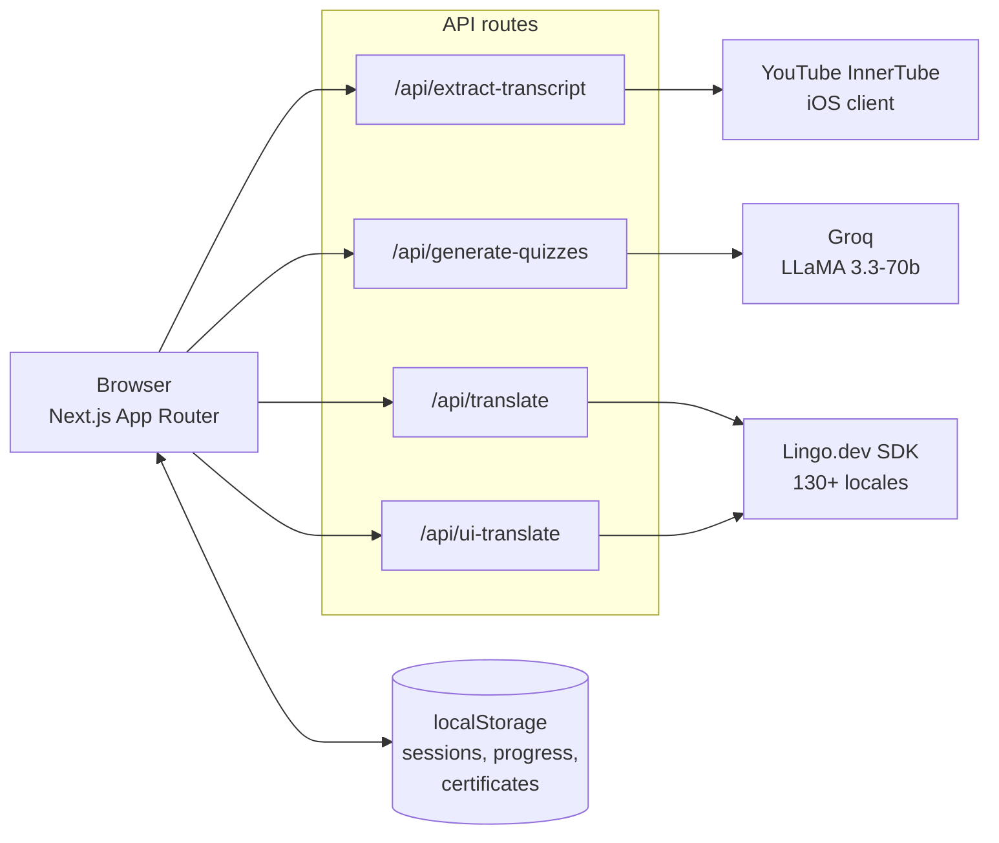
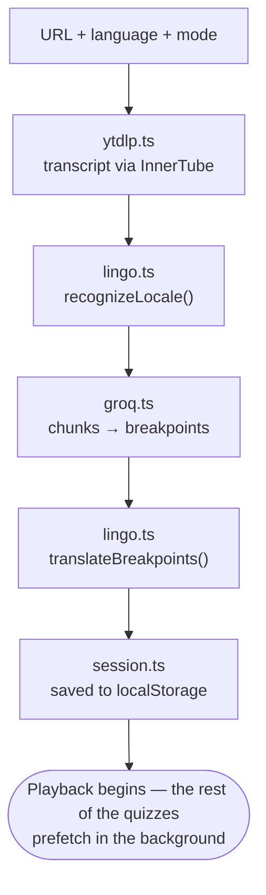

## I lasted eleven minutes

I opened a 45-minute Golang concurrency tutorial. Somewhere around minute eleven a recommendation caught my eye, and I finished the evening watching Shorts. Not one goroutine learned.

The uncomfortable part isn't the distraction. It's that watching *feels* like learning. You sit through 45 minutes, close the tab, and have no way to tell whether anything landed — because nothing ever asked you.

And there's a second, bigger version of the problem. Roughly 800 million people watch English-language YouTube without English as their first language. They get auto-translated captions and that's it. No comprehension layer, no check, no proof. Just watching and hoping.

Udemy and Coursera solved this years ago with quizzes and certificates. YouTube — the largest classroom on earth — has none of it.

## So I built LingoLearn

Paste a YouTube URL. AI reads the transcript, picks the natural topic breaks, and writes quizzes for each one. The video pauses at those points and asks. Get it right, it plays on. Get it wrong, you get a different question on the same idea, and the player rewinds to where it was explained. Clear the final quiz and you get a certificate.

All of it — questions, options, explanations, the interface, your companion's dialogue, the certificate labels — translates into **130+ languages**, with RTL support. Not subtitles bolted onto an English app. The whole thing.

Built in seven days for the [Lingo.dev hackathon](https://lingo.dev).

**[90-second promo](https://youtu.be/A4kRh5K-mSo)** · **[Full walkthrough](https://youtu.be/E97xhtWxmYY)** · **[Source](https://github.com/Prateek1771/LingoLearn)**

---

## The map

Every route in the app, and how you move between them:


Three entry points off the homepage — start a session from a URL, browse the curated gallery (26+ paths across coding, cooking, music, science, kids, fitness, art and language learning), or pick up something you already started.

## The architecture

No server of my own doing any real work. Four API routes, three external services, and the browser holding the state:



The pipeline, in the order it runs:

```
YouTube URL → transcript (InnerTube) → locale detection (Lingo.dev)
            → quiz generation (Groq / LLaMA 3.3-70b) → translation (Lingo.dev)
            → learning session → certificate (html2canvas + jsPDF)
```

### Stack

| Layer | Technology |
|-------|-----------|
| Framework | Next.js 16.1.6, React 19.2.3, TypeScript 5 |
| Styling | Tailwind CSS v4, dark/light, glassmorphism panels |
| Quizzes | `groq-sdk` — LLaMA 3.3-70b-versatile |
| Translation | `@lingo.dev/_sdk` + `@lingo.dev/_locales` |
| Video | `react-player` v3 |
| Transcript | `youtubei.js` (InnerTube), `youtube-caption-extractor` |
| Certificates | `html2canvas` + `jspdf` |
| Storage | localStorage — no database |
| Font | VT323, for the pixel-art look |

Three environment variables: `GROQ_API_KEY`, `LINGODOTDEV_API_KEY`, `LINGODOTDEV_ENGINE_ID`. No `DATABASE_URL`, no Docker, no Python binary. Clone it and it runs.

---

## The bug that ate an evening

Transcripts came back for the wrong video. Not garbled — *stale*. Paste video A, then video B, and B's session would be built from A's transcript. Cache headers didn't help. `no-store` didn't help.

Next.js instruments the global `fetch`. That's the whole point of its data cache, and it's usually what you want. It is emphatically not what you want when you're POSTing to YouTube's InnerTube endpoint with a different payload every time and the framework decides two of those requests look alike.

You can't opt out of an instrumented `fetch` from inside `fetch`. So I stopped using it:

```ts
/**
 * Raw HTTPS POST — bypasses Next.js global fetch patching/caching.
 * Next.js patches global fetch to add caching/deduplication;
 * using node:https directly ensures YouTube sees a clean,
 * uncached request.
 */
async function rawPost(
  url: string,
  body: string,
  headers: Record<string, string>
): Promise<string> {
  const { request } = await import("https");
  const parsed = new URL(url);
  return new Promise((resolve, reject) => {
    const bodyBuf = Buffer.from(body, "utf-8");
    const req = request(
      {
        hostname: parsed.hostname,
        path: parsed.pathname + parsed.search,
        method: "POST",
        headers: { ...headers, "Content-Length": bodyBuf.length },
      },
      (res) => {
        const chunks: Buffer[] = [];
        res.on("data", (c: Buffer) => chunks.push(c));
        res.on("end", () =>
          resolve(Buffer.concat(chunks).toString("utf-8"))
        );
      }
    );
    req.on("error", reject);
    req.write(bodyBuf);
    req.end();
  });
}
```

Twenty lines of `node:https` instead of one line of `fetch`. The lesson I actually took from it: when a framework's magic misbehaves, check what it wrapped before you go looking for the flag to turn it off.

---

## Translating a nested object with a flat API

Lingo.dev's `localizeObject` wants flat key/value pairs. A breakpoint is anything but flat — a topic, a set of primary questions, a set of retry questions, and each question carries a prompt, an explanation and an options array.

Flatten it, translate the flat thing in batches, then walk a pointer back through the original shape to rebuild it. The pointer is the trick: translation preserves array order, so reconstruction is just reading the array in the same sequence you wrote it.

```ts
const flatStrings: string[] = [];
breakpoints.forEach((bp) => {
  flatStrings.push(bp.topic);
  bp.primaryQuestions.forEach((q) => {
    flatStrings.push(q.question);
    flatStrings.push(q.explanation || "");
    q.options.forEach((opt) => flatStrings.push(opt));
  });
  // ...same for bp.retryQuestions
});

const chunkSize = 50;
const PARALLEL_BATCH = 3;
// chunk flatStrings, then 3 chunks in flight at a time
for (let i = 0; i < chunks.length; i += PARALLEL_BATCH) {
  const batch = chunks.slice(i, i + PARALLEL_BATCH);
  const results = await Promise.all(
    batch.map((chunk) =>
      engine.localizeStringArray(chunk, {
        sourceLocale,
        targetLocale,
      })
    )
  );
  results.forEach((r) => translatedStrings.push(...r));
}

let ptr = 0;
return breakpoints.map((bp) => {
  const topic = translatedStrings[ptr++];
  const primaryQuestions = bp.primaryQuestions.map((q) => {
    const question = translatedStrings[ptr++];
    const explanation = translatedStrings[ptr++];
    const options = q.options.map(() => translatedStrings[ptr++]);
    return { ...q, question, explanation, options };
  });
  // ...same for retryQuestions
  return { ...bp, topic, primaryQuestions, retryQuestions };
});
```

Chunks of 50 with three requests in flight: big enough to be fast, small enough that Lingo.dev never returns payload-too-large. Translation isn't one call in this app either — it happens at five points: locale recognition on the raw transcript, timestamped subtitles, quiz objects, companion dialogue, and certificate labels including the date format for the target locale.

---

## What happens at a breakpoint

The playback state machine — this is the part I diagrammed before writing any of it:


And the setup path as code flow — which module owns each step between a pasted URL and a playable session:



Both question sets are generated in a single Groq call per chunk. Generating the retry set lazily would mean an API round trip at the exact moment someone is already annoyed at getting it wrong.

### How often it interrupts you

Keyed on video length, not on how you're doing:

| Video duration | Breakpoints | Questions each |
|---------------|-------------|----------------|
| under 10 min | 2 | 2 |
| 10–30 min | 3–4 | 2 |
| 30–60 min | 4–6 | 3 |
| 60–120 min | 6–8 | 3 |
| over 120 min | 8–10 (capped) | 3 |

The cap is the point. A three-hour lecture with a quiz every five minutes isn't rigorous, it's exhausting. Longer videos get more checkpoints but never more than three questions at each.

Only the first 20 minutes of quizzes are generated before the session opens. The rest are prefetched in the background while you watch, so the wait to start doesn't scale with video length.

---

## Companions and certificates

Fifteen pixel-art characters — wizards, knights, rogues — from the Soul Knight sprite sets. Each has idle, celebrating and encouraging states, follows your cursor, and talks to you in speech bubbles, translated along with everything else. Pick one in Jolly mode, or take Focus mode and get none of it.


Certificates render in the browser with `html2canvas` and `jspdf`. Nothing is uploaded to produce them, and the labels and date format follow the language you learned in — "Certificate of Completion" in your language, `DD/MM/YYYY` where that's what people write.

---

## What I traded away

**No database, no auth.** localStorage held everything: sessions, progress, certificates. Paste a URL and go — no signup wall in front of a demo. The bill came due immediately: no cross-device sync, and no certificate URL you can send anyone.

**yt-dlp, rejected.** The obvious transcript tool needs a Python binary, which serverless hosting doesn't hand you. InnerTube is an HTTP call.

**OpenAI, rejected.** Groq returned quizzes in about two seconds against roughly eight. When the user is staring at a spinner before their lesson starts, that gap is the whole experience.

**Token counting by `words * 1.3`.** An estimate, not a tokenizer. It's wrong at the margins and it has never once mattered.

**Rate limits handled reactively** — exponential backoff with jitter, rather than tracking a budget I'd have had to model correctly under time pressure.

**Translation fails soft.** A session still gets created if part of the translation didn't come back, falling back rather than throwing away everything the user waited for.

---

## Life after the deadline

localStorage was the right call for seven days and the wrong call for the month after. The thing everyone asked for was the thing it couldn't do: send someone your certificate.

Persistence has since moved to **Neon** (serverless Postgres) with **Drizzle** on top, using the localStorage session shape as the starting point for the tables — it was already the right model, just living in the wrong place. That work isn't in the public repo yet, so if you clone it today you get the client-side version described above.

Still on the list:

- Shareable certificate URLs, now that there's somewhere to put them
- Collaborative sessions — same video, same quizzes, racing
- Spaced repetition, using the forgetting curve against your quiz history
- Teacher-injected questions at specific timestamps

---

## Credits

**[Lingo.dev](https://lingo.dev)** for running the hackathon and for an SDK that made 130+ languages a feature rather than a project. **[Groq](https://groq.com)** for inference fast enough that quiz generation feels like a page load. **Soul Knight** for the sprite work — the companions are the part people remember.

If you've ever opened a tutorial and surfaced 40 minutes later knowing more about penguins than the thing you sat down to learn: [it's on GitHub](https://github.com/Prateek1771/LingoLearn).

*Originally published [on dev.to](https://dev.to/prateek_hitli_5a7d19f1c87/i-got-distracted-watching-a-golang-tutorial-so-i-built-an-project-that-wont-let-you-843).*
