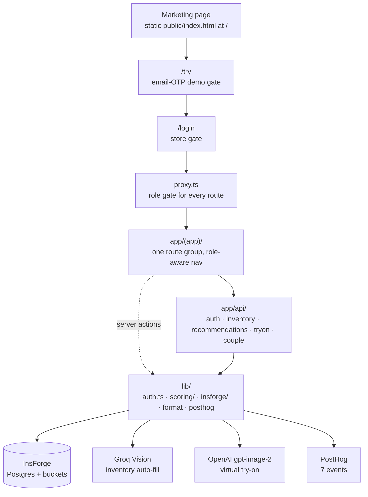
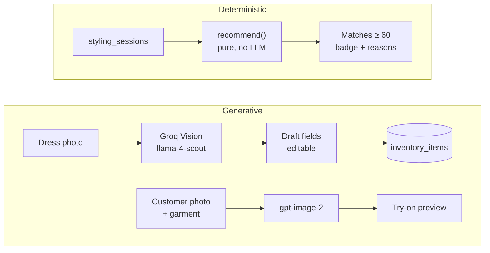

## It is not an ecommerce site

That's the first thing to say about VivahStyle, because every other decision follows from it. Customers never open the app. Store staff drive it, on tablets, standing next to the customer.

The thing it replaces is the usual boutique consultation: someone walks in, staff ask a few questions, pull out whatever's near the front, and the customer leaves having seen forty outfits and remembering none. Nobody wrote anything down, so the store learns nothing either.

What it replaces it with is a flow:

**onboard → explore → AI-suggested matches → try-on → bill → analyse**

About two minutes of structured onboarding, a filtered grid, a scored shortlist for *this* customer, a generated preview of them wearing the outfit, an invoice, and a dashboard that finally knows what sells.

**[Live demo](https://laura-dress.vercel.app)** · **[Source](https://github.com/Prateek1771/Vivah_styles)**

---

## Shape of it



Two details in there cost real time to arrive at.

**`proxy.ts`, not `middleware.ts`.** That's Next 16's convention for the same file, and it's the role gate for every route in the app.

**One `app/(app)/` group, not three.** The obvious layout for a three-role app is `(stylist)`, `(cashier)`, `(admin)` — and Next forbids it, because two route groups can't resolve to the same URL path. So there's a single group with role-aware navigation, and role checks live in the gate *and* in every route handler and server action via `requireRole()`. Two enforcement points, deliberately: the gate is a convenience, the handler check is the actual security boundary.

Sessions are HMAC-signed cookies with bcrypt password hashing — no third-party auth library, no component library, no state manager. That's by design in this codebase.

## Three roles, three home pages

| Role | Device | Can do |
|---|---|---|
| **Stylist** | Tablet | Onboarding, explore, Shop Suggested, virtual try-on |
| **Cashier** | Tablet / desktop | Billing, returns |
| **Owner** | Desktop | Inventory CRUD, Groq auto-fill, dashboard, billing, returns, staff & store settings |

Each role lands on its own page at login: Stylist → `/onboarding`, Cashier → `/billing`, Owner → `/dashboard`. The role comes from the password entered at the store gate, which is the right amount of ceremony for a shared tablet behind a counter.

---

## Where the AI is — and where it deliberately isn't



Adding a dress used to be a data-entry chore, so it's now a photo drop: Groq Vision fills in name, category, gender, colours, occasion tags, fabric and a suggested price. Everything it writes is editable, because a vision model guessing "mustard" at "gold" is a one-tap fix and an argument-free one.

Try-on is `gpt-image-2` through `/v1/images/edits`, called with plain `fetch` — no OpenAI SDK for one endpoint. Customer photo goes in with consent, the preview lands in a per-session gallery, and it works for walk-ins with no session at all.

And then the recommendations, which everyone assumes are the AI part, use **no model whatsoever**.

## The scoring engine

`lib/scoring/` is pure: no DB, no fetch, no randomness. Same inputs, same outputs, every time — which is why the repo can ship `*_check.mjs` self-checks next to it and why a stylist can be told *why* something was suggested.

Hard filters first, and they're unglamorous on purpose:

```ts
function passesHardFilters(session: SessionPreferences, item: InventoryItem): boolean {
  if (!item.active) return false;
  if (item.availability === 'out_of_stock') return false;
  if (session.shopping_for === 'male' && item.gender !== 'men') return false;
  if (session.shopping_for === 'female' && item.gender !== 'women') return false;
  if (
    session.category &&
    session.shopping_for !== 'couple' &&
    item.category !== session.category
  )
    return false;
  return true;
}
```

Whatever survives gets scored on occasion, budget, colour and availability. Everything at 60 or above is returned — no top-N cap — each with a match badge and reason chips. In a shop, "here are the eleven things that fit" beats "here are the best three" every time, because the customer is standing right there and will reject four of them on sight.

## Skin-tone matching is a matrix, not a model

Onboarding optionally collects skin tone (fair / wheatish / medium / tan / deep). If it's there, colour scoring uses it:

```ts
function scoreColor(session: SessionPreferences, item: InventoryItem): number {
  // Palette = flattering skin-tone colors ∪ occasion colors. No skin tone + no mapped
  // occasion → flat noData (unchanged behavior for skipped / kids / couple / `other` rows).
  const palette = new Set<Color>(session.skin_tone ? SKIN_TONE_COLORS[session.skin_tone] : []);
  for (const occ of session.occasions) for (const c of OCCASION_COLORS[occ] ?? []) palette.add(c);
  if (palette.size === 0) return COLOR_WEIGHTS.noData;
  return item.colors.some((c) => palette.has(c)) ? COLOR_WEIGHTS.match : COLOR_WEIGHTS.none;
}
```

The palette is a **union**, not an intersection — colours that suit the person, plus colours that suit the event. And when skin tone is null, the score is a flat `noData` rather than a penalty, so skipping a personal question costs the customer nothing in the results. That mattered more than it sounds: an optional field that quietly degrades your recommendations isn't optional.

The matrices themselves are hand-written from colour theory, living in `lib/scoring/matrices.ts`:

```ts
fair:     ['navy', 'emerald', 'burgundy', 'maroon', 'royal_blue', 'black']
wheatish: ['emerald', 'burgundy', 'maroon', 'royal_blue', 'gold', 'mustard', 'rust', 'teal']
medium:   ['burgundy', 'emerald', 'royal_blue', 'maroon', 'gold', 'orange', 'crimson']
tan:      ['white', 'ivory', 'gold', 'coral', 'teal', 'magenta', 'crimson']
deep:     ['white', 'ivory', 'gold', 'yellow', 'crimson', 'cobalt', 'fuchsia']
```

```ts
haldi:    ['mustard', 'yellow', 'orange', 'ivory']
mehendi:  ['green', 'olive', 'emerald', 'yellow', 'teal']
wedding:  ['crimson', 'maroon', 'burgundy', 'emerald', 'gold', 'royal_blue', 'magenta']
sangeet:  ['royal_blue', 'magenta', 'emerald', 'burgundy']
cocktail: ['black', 'burgundy', 'royal_blue', 'emerald', 'magenta']
```

Nine occasions, five tones, one lookup. A model could have produced something like this, at the cost of latency, non-determinism, and an answer nobody in the shop could argue with.


## Couples

For a couple, the engine scores *pairs*:

```
score = 0.6 × coupleCompatibility + 0.4 × individual
```

Compatibility blends a colour-harmony matrix with theme and fabric. The harmony matrix is the part that reads like a stylist wrote it, because it is:

```ts
maroon:     { ivory: 95, gold: 95 }
royal_blue: { gold: 90, ivory: 90 }
emerald:    { champagne: 88, gold: 88 }
lavender:   { grey: 82, blush: 82, champagne: 82 }
```

Alongside it, a gallery of real couple photos as inspiration — and those looks can be tried on directly, where one generation dresses both partners from a single couple photo.

## What it refuses to do

- **Billing records payments; it processes none.** Cash / UPI / Card / Net Banking with a mode-specific field, tax computed server-side, printable invoice. No gateway. A boutique already has a card machine.
- **Returns are record-only** in V1 — `dress_id` plus notes, stock reconciled by hand.
- **Out of scope entirely:** public storefront, rentals, appointment scheduling, customer self-service, multi-store SaaS, SMS/WhatsApp.

And the invariants worth keeping in a codebase two people will touch later: `lib/scoring/` stays pure; `GROQ_API_KEY`, `OPENAI_API_KEY`, `INSFORGE_API_KEY` and `SESSION_SECRET` are server-only and never reach the client bundle; every enum string comes from `lib/constants.ts`; prices render through `formatINR()`; `dress_id` is unique and never reused, because billing and returns both key off it; passwords are bcrypt hashes; no hex values in components, tokens only.

---

## Data model

All of it in InsForge Postgres: `store_settings`, `staff`, `inventory_items` (with a `details` jsonb for the rich detail page), `styling_sessions`, `recommendations`, `tryons` (`generating` → `ready` / `failed`), `bills` + `bill_items`, `returns`, and `demo_visitors` for the OTP gate. Three storage buckets: `inventory-images` public, `customer-photos` and `tryon-previews` private — the ones holding a customer's face are not the public ones.

## Try it

The [demo](https://laura-dress.vercel.app) is live; `/try` is the email-OTP gate that walks you in. The seeded staff logins are in the repo's README rather than here — they're credentials for a running deployment, and a blog post is a worse place to leave them lying around.
